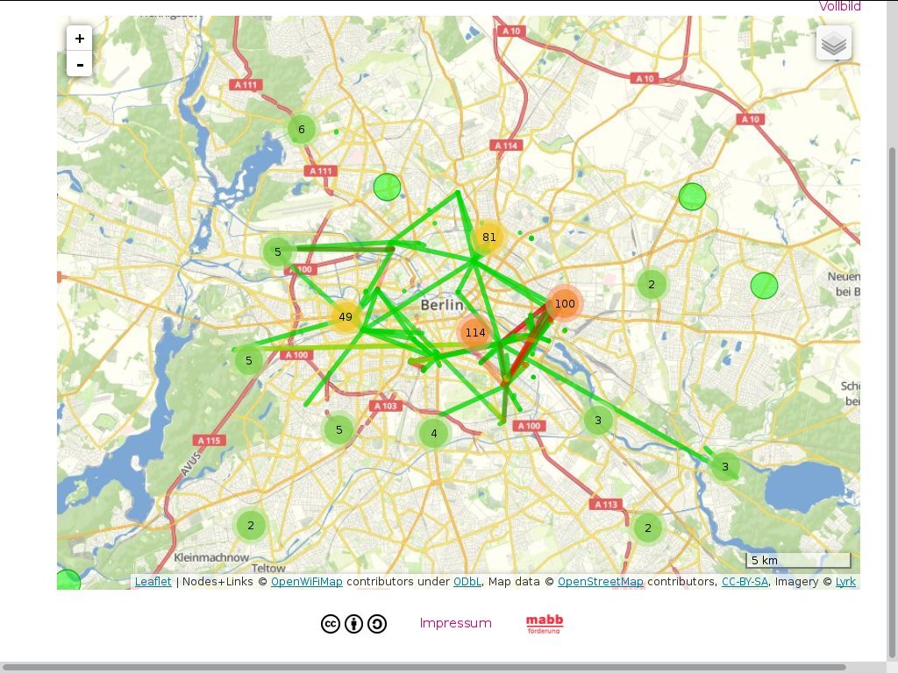

# Freifunk

---

# Was ist Freifunk

* freies Netzwerk an dem jeder/jede teilnehmen kann
    * einfach das Netz zum Surfen nutzen
    * das Netz mit einem Router erweitern
    * Inhalte zur Verfügung stellen, z.B. Webseiten, Minecraft-Server
    * die Freifunk Idee verbreiten
* ein Netz das allen gehört (Gemeingut)
* Seite: [http://berlin.freifunk.net](http://berlin.freifunk.net)
* twitter: [http://twitter.com/freifunk_berlin](http://twitter.com/freifunk_berlin)

---

# Karte

---

# Impressionen vom Freifunk

---

# Impressionen vom Freifunk

---

# Impressionen vom Freifunk

---

# Freifunk @ Andreas-Gymnasium

* Installation auf dem Dach (Turm)
* WLAN-Verbindung z.B. zum Rathaus Neukölln und zur Segenskirche (Prenzlauer Berg)
* Access Points für den Schulhof
* Aufbau mit der WLAN-AG

---

# Netzwerkgrundlagen

---

# Wifi/WLAN

* elektromagnetische Welle
    * z.B. Radio, Satellitenfernsehn, Handy, Router, Bluetooth, ...
* verschiedene Frequenzbereiche im WLAN:
    * 2.4GHz (Kanal 1-13)
    * 5GHz (Kanal 36-140)

* zwei wichtige Modi:
    * Adhoc (http://berlin.freifunk.net/static/img/adhoc_netz_wikipedia.png)
    * Accesspoint/Client

* verhält sich wie Kabelnetzwerk (nur dass bei Wifi Pakete oft verloren gehen)

---

# Antennen

* Antennen habe eine Richtung in die sie strahlen (Richtcharakteristik)
* Verschiedene Antennentypen:
    * Rundstrahler
    * Parabolantenne
    * Panelantenne

---

# Datenübertragung

* Daten werden in Paketen zwischen Rechnern übertragen
* jedes Paket hat eine Ziel-Adresse und eine Absender-Adresse
* Domains (z.B. freifunk.net) werden umgewandelt in eine IP-Adresse (176.28.11.93), DNS

---

## IP-Adressen

* Wie normale Adressen (Post)
* Wie sieht eine IP-Adresse aus (192.168.42.1)
* großer Zahlenbereich von 0.0.0.0-255.255.255.255
* Wikipedia: [https://de.wikipedia.org/wiki/IP-Adresse](https://de.wikipedia.org/wiki/IP-Adresse)

---

## Subnetze

* Aufteilung des IP-Addressbereichs in Teilnetze
* Subnetz ist sowas wie eine Postleitzahlbereich
* Subnetz entsteht aus Subnetzmaske und Netz-IP
* Subnetzmaske sieht aus wie eine IP z.B. 255.255.255.0
* Beispiele:
    * großes Netz: 192.168.42.0, 255.255.255.0
    * kleineres Netz: 192.168.42.0, 255.255.255.128
* (Größe des Subnetz 2^(32 - x))
* Wikipedia: [https://de.wikipedia.org/wiki/Subnetz](https://de.wikipedia.org/wiki/Subnetz)

---

# Routing-Spiel

* wir bilden zweier/dreier Gruppen
* jede Gruppe bekommt eine IP (z.B. 10.230.62.1) und eine Routingtabelle, z.B.:
* standard via 10.230.62.1
* 10.230.62.23 via 10.230.62.42

---

# Router einrichten

* Jede Gruppe erhält einen Router
* Zu jedem Router gehören zwei "Mesh-IPs" und ein DHCP-Subnetz
* Jede Gruppe konfiguriert einen Router fürs Freifunk

---

# IP-Konfiguration

Wir nutzen die IP range: 10.230.62.0/24

Mesh IPs: 10.230.62.0/27

1. 10.230.62.1 und 10.230.62.11
2. 10.230.62.2 und 10.230.62.12
3. 10.230.62.3 und 10.230.62.13
4. 10.230.62.4 und 10.230.62.14
5. 10.230.62.5 und 10.230.62.15
6. 10.230.62.6 und 10.230.62.16
7. 10.230.62.7 und 10.230.62.17
8. 10.230.62.8 und 10.230.62.18

---

# Subnetz-Konfiguration (DHCP-IPs)

1. 10.230.62.32/28
2. 10.230.62.48/28
3. 10.230.62.64/28
4. 10.230.62.80/28
5. 10.230.62.96/28
6. 10.230.62.112/28
7. 10.230.62.128/28
8. 10.230.62.144/28

---

# Grundlagen von OLSR

TBD
