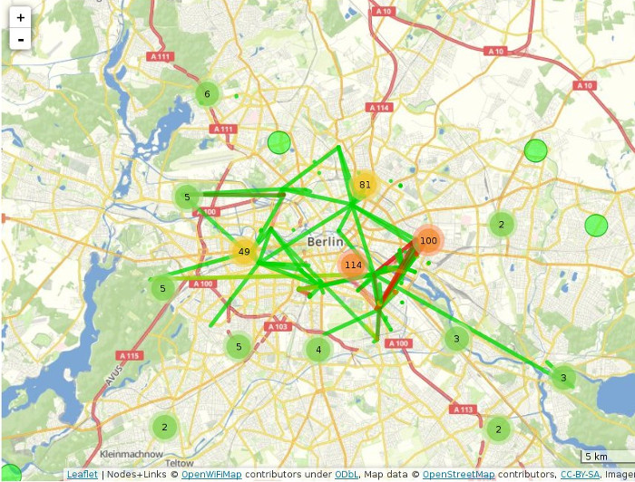
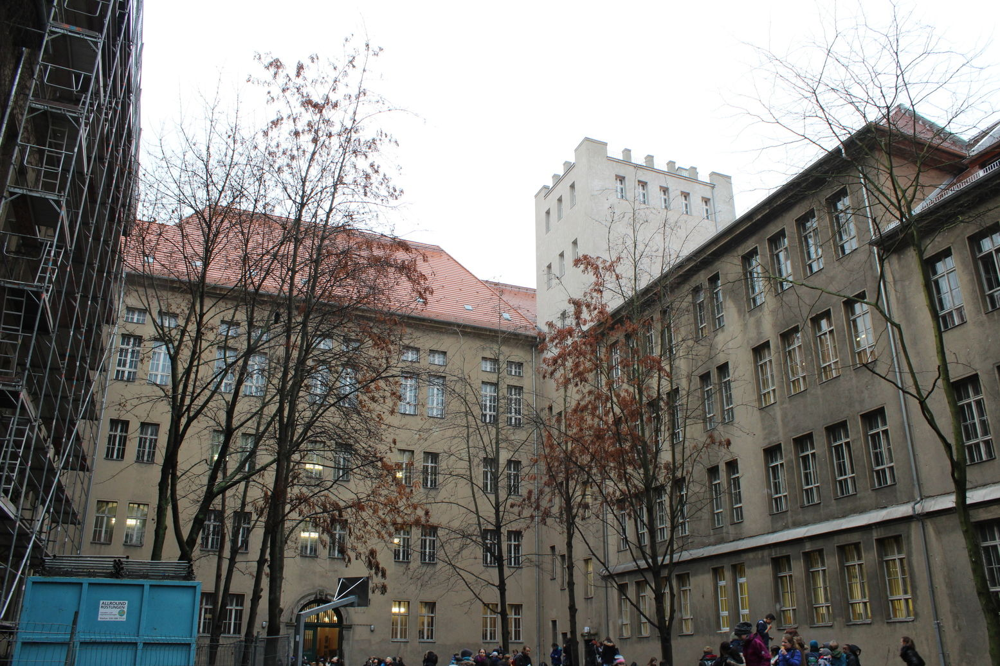

# Freifunk

---

# Was ist Freifunk

* freies Netzwerk an dem jede/jeder teilnehmen kann
* ein Stück selbstgebautes Internet das allen gehört (Gemeingut)
* Wie mach ich mit:
    * einfach das Netz zum Surfen nutzen
    * das Netz mit einem WLAN-Router erweitern
    * Inhalte zur Verfügung stellen, z.B. Webseiten, Minecraft-Server
    * die Freifunk Idee verbreiten (Flyer, Sticker)
* Seite: [http://berlin.freifunk.net](http://berlin.freifunk.net)
* twitter: [http://twitter.com/freifunk_berlin](http://twitter.com/freifunk_berlin)

---

# Karte

---

# Impressionen vom Freifunk

---

# Impressionen vom Freifunk

---

# Impressionen vom Freifunk

---

# Freifunk @ Andreas-Gymnasium

* Installation auf dem Dach (Turm)
* WLAN-Verbindung z.B. zum Rathaus Neukölln und zur Segenskirche (Prenzlauer Berg)
* Access Points für den Schulhof
* Aufbau mit der WLAN-AG

---

# Netzwerkgrundlagen

---

# Wifi/WLAN

* elektromagnetische Welle
    * z.B. Radio, Satellitenfernsehn, Handy, Router, Bluetooth, ...
* verschiedene Frequenzbereiche im WLAN:
    * 2.4GHz (Kanal 1-13)
    * 5GHz (Kanal 36-140)
* zwei wichtige Modi:
    * Adhoc (alle Teilnehmer gleichwertig, koordinieren sich untereinander)
    * Accesspoint/Client (ein Teilnehmer koordiniert den Rest )
* verhält sich wie Kabelnetzwerk (nur dass bei Wifi Pakete oft verloren gehen)

---

# Antennen

* Antennen habe einen Richtung in die sie funken (Richtcharakteristik)
* Verschiedene Antennentypen:
    * Rundstrahler
    * Parabolantenne
    * Panelantenne

---

# Datenübertragung

* Daten werden in Paketen zwischen Rechnern übertragen
* jedes Paket hat eine Ziel-Adresse und eine Absender-Adresse
* Domains (z.B. freifunk.net) werden umgewandelt in eine IP-Adresse (176.28.11.93), DNS

---

# IP-Adressen

* Wie normale Adressen (Post)
* Wie sieht eine IP-Adresse aus (192.168.42.1)
* großer Zahlenbereich von 0.0.0.0-255.255.255.255
* Wikipedia: [https://de.wikipedia.org/wiki/IP-Adresse](https://de.wikipedia.org/wiki/IP-Adresse)

---

# Subnetze

* Aufteilung des IP-Adressbereichs in Teilnetze
* Subnetz ist sowas wie ein Postleitzahlbereich
* Ein Subnetz besteht aus einer Netz-IP und einem Suffix "Größenangabe"
* Beispiele:
    * `192.168.42.128/32` (1 IP: 192.168.42.128)
    * `192.168.42.128/31` (2 IPs: 192.168.42.128-192.168.42.129)
    * `192.168.42.128/30` (4 IPs: 192.168.42.128-192.168.42.131)
    * `192.168.42.128/29` (8 IPs: 192.168.42.128-192.168.42.135)
    * `192.168.42.128/28` (16 IPs: 192.168.42.128-192.168.42.143)
    * ...
    * `192.0.0.0/8` (16 Millionen IPs: 192.0.0.0-192.255.255.255)
* Wikipedia: [https://de.wikipedia.org/wiki/Subnetz](https://de.wikipedia.org/wiki/Subnetz)

---

# Routing

* Über Routingtabellen verbindet man Subnetze miteinander
* "Welchem Router muss ich das Paket weiterreichen damit es sein Ziel erreicht?"
* Typische Routingtabelle:

<pre>
    Ziel                   Router
    -----------------------------------
    Standard         über  192.168.42.1
    10.230.0.0/16    über  10.230.62.8
    192.168.42.0/24        direkt
    10.230.62.8/28         direkt
</pre>

* Ein Paket mit der Ziel-IP `10.230.62.122` wird z.B. dem Router `10.230.62.8` übergeben.
* Wikipedia: [https://de.wikipedia.org/wiki/Routingtabelle](https://de.wikipedia.org/wiki/Routingtabelle)

---

# Routing-Spiel

* wir bilden zweier/dreier Gruppen (insgesamt 8 Gruppen)
* jede Gruppe bekommt eine IP (z.B. 10.230.62.1) und eine Routingtabelle (s.u.)
* jede Gruppe schickt ein Paket mit einer Zieladresse (10.230.62.1-8) auf die Reise

<pre>
    Ziel               Router
    ----------------------------------
    Standard     über  10.230.62.2
    10.230.62.7  über  10.230.62.8
    10.230.62.6  über  10.230.62.8
    10.230.62.5  über  10.230.62.8
    10.230.62.8        direkter Nachbar
    10.230.62.2        direkter Nachbar
</pre>

---

# Grundlagen von OLSR

* Jeder Router sagt seinen Nachbarn "Hallo"
* Jeder Router lernt so seine Nachbarn kennen
* Aus den Informationen über die Nachbarn generiert jeder Router seine Routing-Tabelle
* Wenn ein Router ausfällt übernehmen andere Router die Weiterleitung der Paket

---

# Router einrichten

* Jede Gruppe erhält einen Router
* Zu jedem Router gehören zwei "Mesh-IPs" und ein DHCP-Subnetz (IPs für Smartphones & Notebooks)
* Jede Gruppe konfiguriert einen Router fürs Freifunk
* Der WLAN-Name (SSID) soll nach der Gruppe benannt sein, z.B. `gruppe3.freifunk.net`.

---

# Freifunk-Installation auf dem Schuldach

